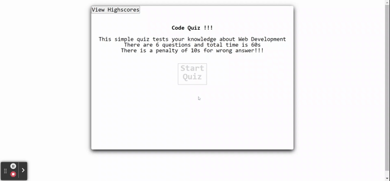

# Code-Quiz

This assignment is part of week 4  USYD's coding bootcamp. 

This is a quiz application using HTML, CSS, and Javascript. This application emphasizes the use of Javascript to provide quiz questions and collect user data to determine whether the answers to a question are correct, this then generates a score and appends a final page of results from the user data. 

This project has been deployed to GitHub Pages. To get this project up and running, you can follow the deployment link. 

* [GitHub Repository](https://github.com/thossain89/Code_Quiz)
* [Deployed GitHub IO](https://thossain89.github.io/Code_Quiz/)  

  

### Prerequisites

This web app will run in any modern browser. Google chrome is recommended for better user experience.  
### Summary

* HTML and CSS and Javascript documents create a quiz with multiple choice questions with Javascript trivia.
* This project emphasizes the use of using Javascript to make dynamic changes to an HTML document.
* This project utilizes the use of appending HTML pages.
* Basic JSON usage to access local storage of the browser.  

### This project has the following features:  

* A Start Quiz button  

    * This starts a timer for the user
    * Each question averages 10 seconds each and total time of 60 seconds.  

* Questions with four answer choices  

    * The circles at bottom right shows questions left to answer.
    * For correct answer the circle becomes green.
    * For Wrong answer the circle becomes red.
    * On left bottom it shows time left and and bar which reduces as time progresses
    * For wrong answer 10s is penalized and the time adjusts to new remaining time and the bar adjusts too.  

* Highscore List  

    * Once user finish quiz they are given their score and option to save their score by putting their initials.
    * Then after submitting the score the user is being taken to highscore page to check the list of highscores.
    * On highscore page there are options to go back and re-attempt the quiz or clear the scoreboard.  

### This project has script features of:
* Questions contained in an array variable with objects
* Variable declaration area 
* An event listener (onclick) that generates time interval
* A function to render the questions and choices on the page using a for loop
* An event listener on all list choices 
* A comparison statement to compare correct answers to choices
* An appended page showing the final stats of the individual user with input area for initials, captures local storage
* Highscores retreived local storage  

### Features: 
* Two HTML Pages
    * Index.html 
        * Contains landing page to start timer
        * Appends two new pages 
* Highscores 
        * Retreives local data from previous page
* One CSS Page
    * Styles.css
        * Contains centering and styling for html list features
        * Contains media queries
* Two Javascript Page
        * Contains: 
        * Variables, including arrays with object
        * Event listeners
        * if/else if statements
        * For Loops
        * Functions 
        * Local Storage set and get 

## Authors

* **Tanvir hossain** - *Initial work* - [Git Hub Profile](https://github.com/thossain89  

&copy; 2021 Tanvir Hossain, Coding Bootcamp ,University of Sydney and Trilogy Education

 

    